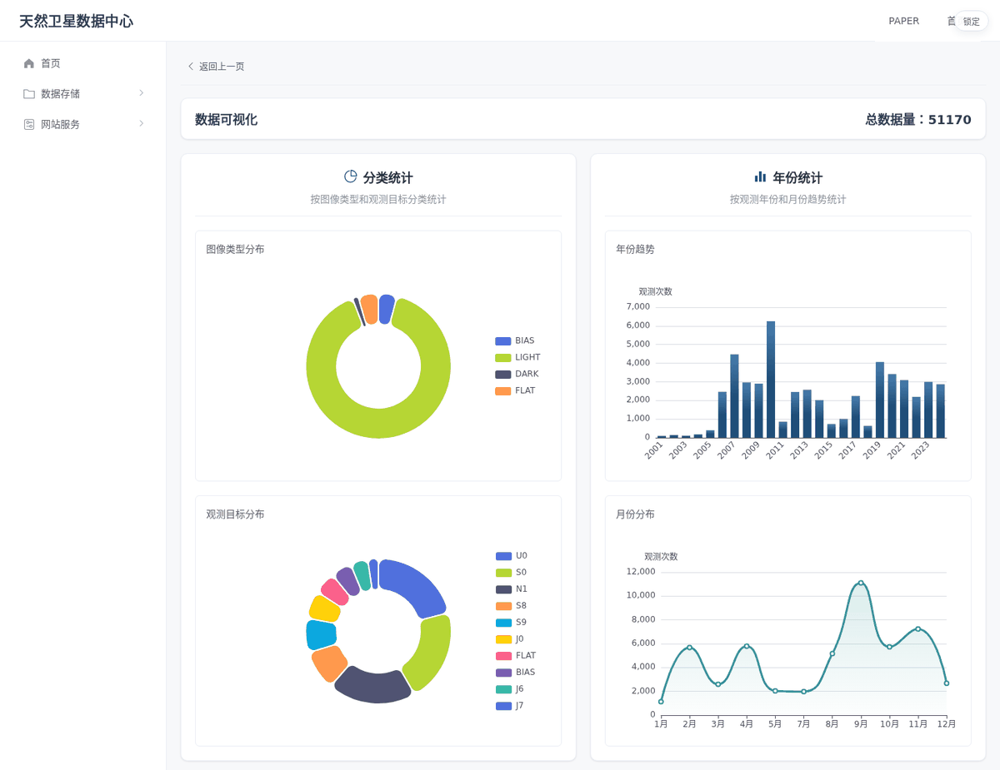
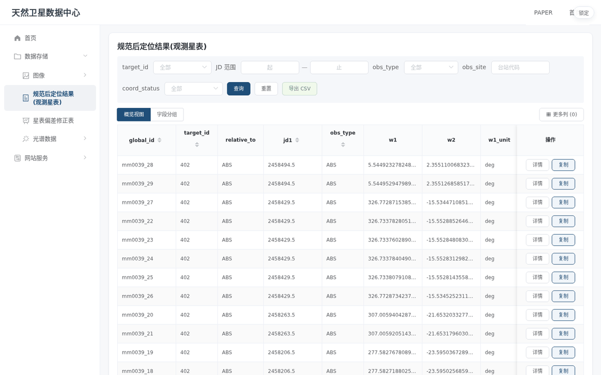
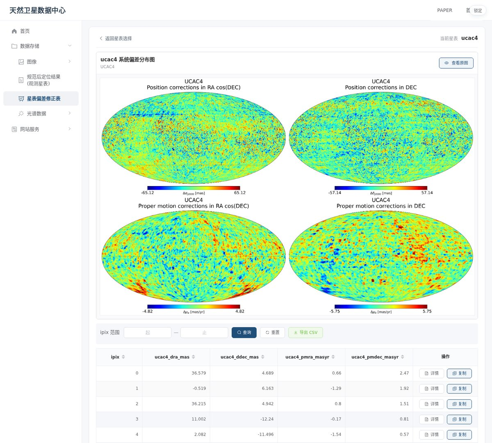
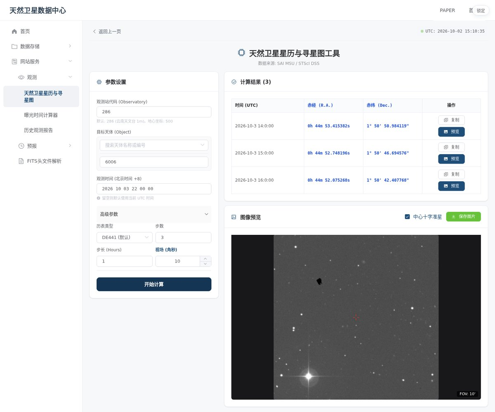
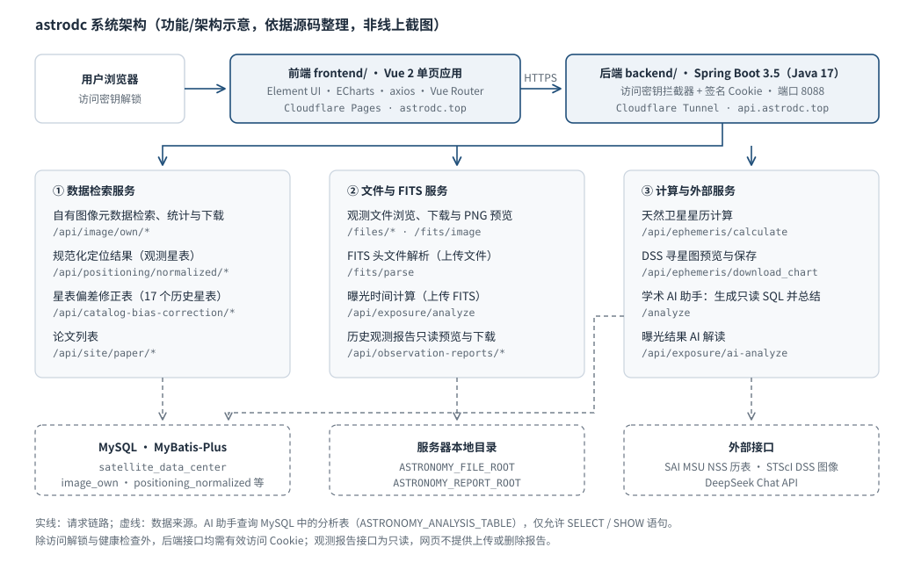

<div align="center">

# 天然卫星数据中心

### Natural Satellite Data Center · astrodc

**面向天然卫星精密天体测量的观测数据检索、星表修正与观测辅助平台**

[](https://astrodc.top)


[项目简介](#项目简介) · [在线体验](#在线体验) · [主要功能](#主要功能) · [界面展示](#界面展示) · [系统架构](#系统架构) · [快速开始](#快速开始) · [仓库结构](#仓库结构) · [相关文档](#相关文档)

</div>

---

## 项目简介

astrodc 是天然卫星数据中心网站的源码，由 Vue 2 前端和 Spring Boot 后端组成。
它围绕巨行星天然卫星的地面观测，把**观测图像元数据、规范化定位结果、历史星表系统偏差修正表**集中到一个可检索的网站中，
并提供**星历与寻星图、曝光时间估算、FITS 头解析、历史观测报告**等观测辅助工具，以及基于 DeepSeek 的学术 AI 助手。

- **数据检索**：按条件检索图像元数据和观测星表，表格浏览、查看详情、导出 CSV。
- **统计可视化**：按图像类型、观测目标、年份和月份统计观测图像数量。
- **观测辅助**：调用 SAI MSU 历表服务计算卫星位置，并取 STScI DSS 图像作为寻星图。
- **访问控制**：网站用访问密钥解锁；除解锁与健康检查外，后端接口均校验签名 Cookie。

## 在线体验

线上网站：**<https://astrodc.top>**（后端 API：`https://api.astrodc.top`）

网站启用了访问密钥，未解锁时只显示密钥输入页；密钥不随仓库公开，如需体验请联系维护者。
2026-10-02 浏览时，下文截图涉及的页面均能正常打开并返回数据。
源码中的 Cloudflare Pages 发布脚本目前处于暂停状态（见 [部署与运维](#部署与运维)），线上版本不一定与 `main` 分支完全一致。

## 主要功能

| 模块 | 网站入口 | 已实现能力 |
|---|---|---|
| 自有图像库 | 数据存储 → 图像 → 自有图像 | 按 FITS 头字段条件检索图像元数据；在结果表中预览图像（后端转为 PNG）、下载文件；浏览观测文件目录 |
| 数据可视化 | 自有图像 → 数据可视化 | 用 ECharts 展示图像类型、观测目标、年份与月份分布 |
| 规范化定位结果（观测星表） | 数据存储 → 规范后定位结果 | 按目标、JD 范围、观测类型、台站代码、坐标状态筛选；概览 / 字段分组视图；导出 CSV |
| 星表偏差修正表 | 数据存储 → 星表偏差修正表 | 17 个历史星表相对 Gaia DR3 的位置与自行修正（HEALPix 网格）；系统偏差全天分布图；按 ipix 查询、导出 CSV |
| 星历与寻星图 | 网站服务 → 观测 → 天然卫星星历与寻星图 | 按台站代码、目标、时间、步数与步长计算位置（SAI MSU，可选 DE441 / DE431 等历表）；DSS 寻星图预览与保存 |
| 曝光时间计算器 | 网站服务 → 观测 → 曝光时间计算器 | 上传 FITS，在后端估计天光背景并按噪声模型求解行星 / 恒星模式的曝光时间；可选 AI 解读 |
| 历史观测报告 | 网站服务 → 观测 → 历史观测报告 | 按台站浏览服务器目录中的报告，在线预览 Word / PDF / Markdown 并下载原文件（只读） |
| FITS 头文件解析 | 网站服务 → FITS 头文件解析 | 上传 FITS 查看头关键字，导出 JSON / CSV |
| 学术 AI 助手 | 右下角按钮 / `/aiagent` | 把自然语言需求转换为只读 SQL（仅 SELECT / SHOW），返回 SQL、查询结果与 AI 摘要 |
| 论文 | 顶栏 PAPER | 按卫星分类展示相关论文列表 |

“其他图像”“光谱数据”“历表位置（IMCCE API）”“JPL DE 系列 + 卫星模型”在导航中已有入口，目前是占位页面。

## 界面展示

以下均为 2026-10-02 在 <https://astrodc.top> 解锁后浏览的真实页面截图（浏览器窗口宽 1440 px，缩放到 1200 px）。
为避免遮挡表格，截图时隐藏了右下角悬浮的“学术 AI 助手”按钮，其余内容未作修改。

**数据可视化**：自有图像库的统计页，按图像类型、观测目标、年份和月份汇总图像记录数。

<p align="center">
  <a href="docs/assets/astrodc-data-visualization.png"></a>
</p>

**规范化定位结果（观测星表）**：多条件筛选的表格视图，可切换字段分组、展开更多列，单行可查看详情或复制。

<p align="center">
  <a href="docs/assets/astrodc-normalized-positioning.png"></a>
</p>

**星表偏差修正表**：以 UCAC4 为例，上方是该星表位置与自行修正量的全天分布图，下方是按 HEALPix 像元（ipix）列出的修正值。

<p align="center">
  <a href="docs/assets/astrodc-catalog-bias-map.jpg"></a>
</p>

**星历与寻星图**：示例为土卫六（MSU 编号 6006）、台站代码 286、北京时间 2026-10-03 22:00 起 3 步、步长 1 小时；
右下是以第一行预报位置为中心的 STScI DSS 图像，红色十字为中心准星。

<p align="center">
  <a href="docs/assets/astrodc-ephemeris-finder.jpg"></a>
</p>

## 系统架构

<p align="center">
  <a href="docs/assets/astrodc-architecture.svg"></a>
</p>

此图是依据源码整理的功能 / 架构示意，不是线上截图。
前端通过 `VUE_APP_API_BASE_URL` 指定后端地址：生产构建为 `https://api.astrodc.top`，未设置时为 `http://localhost:8088`。
星表偏差全天分布图是前端 `public/catalog-bias-maps/` 中的静态 PNG，修正值表格来自后端数据库。

<details>
<summary>技术栈与主要依赖</summary>

| 层 | 技术 | 版本（来自 `package.json` / `pom.xml`） |
|---|---|---|
| 前端框架 | Vue + Vue Router，Vue CLI 构建 | `vue ^2.6.14`，`vue-router ^3.6.5`，`@vue/cli-service ~5.0.0` |
| 界面与图表 | Element UI，ECharts | `element-ui ^2.15.14`，`echarts ^6.0.0` |
| 文档预览 | docx-preview，pdfjs-dist，marked + DOMPurify | `0.4.0`，`6.3.289`，`^16.4.1` + `3.4.15` |
| 后端框架 | Spring Boot（Java 17） | `spring-boot-starter-parent 3.5.6` |
| 数据访问 | MyBatis-Plus，dynamic-datasource，MySQL Connector/J | `3.5.7`，`4.1.3`，`8.0.33` |
| FITS 与网页解析 | nom-tam-fits，jsoup | `1.16.0`，`1.17.2` |
| 外部服务 | SAI MSU NSS 历表，STScI DSS，DeepSeek Chat API | 地址见 `backend/src/main/resources/application.yml` |

</details>

## 快速开始

需要 **Node.js**、**Java 17+** 和 **MySQL**（库名 `satellite_data_center`，连接配置见 `backend/src/main/resources/application.yml`）。
仓库不包含数据库数据、观测图像和观测报告文件。

**1. 配置凭据**：数据库密码、DeepSeek API 密钥、网站访问密钥和数据目录通过环境变量或 `config/application-private.yml` 提供，详见 [配置说明](docs/configuration.md)。

| 环境变量 | 用途 |
|---|---|
| `ASTRONOMY_DB_PASSWORD` | MySQL 密码 |
| `ASTRONOMY_ACCESS_KEY` | 网站解锁密钥与 Cookie 签名；未配置时解锁请求会被拒绝 |
| `DEEPSEEK_API_KEY` | 学术 AI 助手与曝光结果解读 |
| `ASTRONOMY_FILE_ROOT` / `ASTRONOMY_REPORT_ROOT` | 观测图像与观测报告根目录 |

**2. 启动后端**（端口 8088）：

```powershell
cd backend
.\mvnw.cmd spring-boot:run        # Linux / macOS：./mvnw spring-boot:run
```

**3. 启动前端**（端口 8080，默认请求 `http://localhost:8088`）：

```bash
cd frontend
npm ci
npm run serve      # 开发服务器
npm run build      # 生产构建，输出 frontend/dist
```

在 Windows 本机，PowerShell 的 `on` 命令可同时启动前后端，对应脚本为 `scripts/astronomy-control.ps1`。

<details>
<summary>测试与检查</summary>

- 后端：`pom.xml` 默认跳过测试，需显式开启：`.\mvnw.cmd package -DskipTests=false`。
  只运行观测报告相关测试的方法见 [历史观测报告](docs/observation-reports.md#验证)。
- 前端：`frontend/scripts/` 下有若干源码检查脚本，例如 `npm run test:api-config`、`npm run test:access-gate`、
  `npm run test:ephemeris-targets`、`npm run test:catalog-bias-ui`，完整列表见 `frontend/package.json`。

</details>

## 部署与运维

<details>
<summary>Cloudflare Pages、Tunnel 与健康检查</summary>

- 前端：Cloudflare Pages 项目为 `astrodc`，发布目录 `frontend/dist`。**目前部署暂停**，`npm run deploy` 会输出提示并直接退出，不会发布。
- 后端：经 Cloudflare Tunnel 提供 <https://api.astrodc.top>；Windows 自动恢复任务使用 `scripts/start-backend.ps1`，
  隧道开机入口为 `scripts/start-tunnel.ps1`，隧道凭据保存在用户的 `.cloudflared` 目录。
- 健康检查：在项目根目录执行

  ```powershell
  powershell.exe -NoProfile -ExecutionPolicy Bypass -File scripts/check-health.ps1
  ```

  脚本依次检查本机后端 `/analyze/health`、`https://astrodc.top` 与 `https://api.astrodc.top/analyze/health`，
  并确认 8088 端口上的后端进程来自当前检出目录。

</details>

## 仓库结构

```text
astrodc/
├── frontend/                # Vue 2 前端
│   ├── src/components/      # 各功能页面（检索、星表、星历、曝光、报告、AI 助手等）
│   ├── src/router/          # 路由
│   ├── public/              # 静态资源，含星表偏差分布图 catalog-bias-maps/
│   └── scripts/             # 部署脚本与源码检查脚本
├── backend/                 # Spring Boot 后端
│   └── src/main/java/mie/astronomy/
│       ├── controller/      # REST 接口
│       ├── service/         # 业务逻辑与外部服务客户端（MSU、DSS、DeepSeek）
│       └── config/          # 访问密钥、跨域、历表请求等配置
├── docs/                    # 配置与观测报告说明；assets/ 为本 README 图件
└── scripts/                 # Windows 本机启动、隧道与健康检查脚本
```

## 相关文档

- [docs/configuration.md](docs/configuration.md)：后端凭据、数据目录与私有配置文件
- [docs/observation-reports.md](docs/observation-reports.md)：历史观测报告的目录约定、只读接口与测试

**关联项目**：[NSPA · 天然卫星精密天体测量软件](https://github.com/mieyu/natural-satellite-astrometry)，
面向天然卫星 CCD 观测的图像预处理、星象检测、参考星匹配与 O-C 残差分析软件，与本数据中心关注同一类观测数据。
